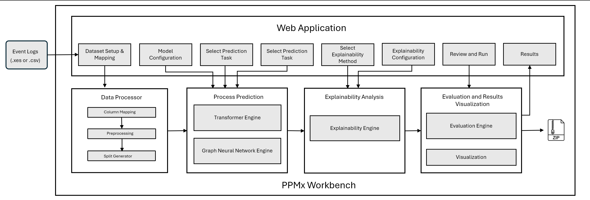
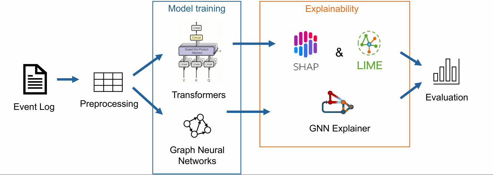
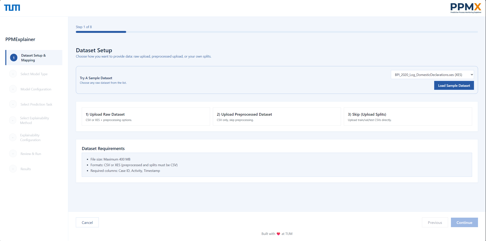

<div align="center">


<br/>

[]()
[](LICENSE)
[]()
[]()
[]()
[]()
[]()

[]()
[]()

</div>

> **PPMx** is a no-code platform for Predictive Process Monitoring (PPM). It provides an end-to-end pipeline from event log preprocessing to model training, explainability, and evaluation supporting **Transformer** and **Graph Neural Network (GNN)** architectures through a browser-based dashboard with no scripting required.

🌐 **Live:** https://ppmx.app/

---

**PPMx Architecture**


**Key Features**
- No-code workflow for training and explainability.
- Transformer and GNN support for next activity, event time, and remaining time.
- Explainability and evaluation in one pipeline.
- Frontend dashboard powered by a FastAPI backend


**Tech Stack**
- Frontend: Vite + React + TypeScript
- Backend: FastAPI + Python
- ML: TensorFlow, PyTorch, PyTorch Geometric

**PPMx System Structure and APIs**
This diagram summarizes the frontend-backend structure and the APIs used across the system.


**PPMx Workflow**


**Requirements**
- Python 3.10+ recommended
- Node.js 18+ recommended

**Quickstart (Frontend + Backend)**
Clone the repository first and then follow the steps: 
1. Create and activate a Python virtual environment inside PPMx dir.
```bash
#Create Virtual environment
python -m venv .venv

# Activate Environment 
# Windows PowerShell
.venv\Scripts\Activate.ps1
# macOS/Linux
source .venv/bin/activate
```

2. Install dependencies.
```bash
pip install -r requirements.txt
```

3. Install frontend dependencies.
```bash
cd frontend
npm install
```

4. Configure the frontend API base URL.
```bash
# Windows PowerShell
Copy-Item .env.example .env.local -ErrorAction SilentlyContinue
# macOS/Linux
cp .env.example .env.local 2>/dev/null || true
```

Add the following to `frontend/.env.local`:
```bash
VITE_API_BASE_URL=http://localhost:8000
```

5. In the New Teminal (T2), Start the backend API.
```bash
uvicorn backend.main:app --reload --port 8000
```

6. In the previous Terminal (T1), Start the frontend dev server.
```bash
npm run dev
```
[Note: The program runs frontend and backend in 2 seperate Terminals (T1 & T2) Simultaneosly]

Frontend will be available at `http://localhost:5173`.

**Starting Dashboard**


**Sample Datasets**
These sample event logs are available from the Dataset Setup step in the UI and can be downloaded from here:

- `BPI_2020_Log_DomesticDeclarations.xes`  
  https://drive.google.com/file/d/1AzsG6xg9ftqQRSW2yyY7gaLcBK1qkSXv/view?usp=sharing
- `BPI_2020_Log_InternationalDeclarations.xes`  
  https://drive.google.com/file/d/1Oz-Mbmlt4n6aiJlHSNUP3oVk-zH5UK82/view?usp=sharing
- `BPI_2020_Log_PrepaidTravelCost.xes`  
  https://drive.google.com/file/d/1dSsgdl3RIetTTNcOOfzgzF3pxG5KLyAg/view?usp=sharing
- `BPI_2020_Log_RequestForPayment.xes`  
  https://drive.google.com/file/d/1V6hbOWKbN2MtnPtOjPAgPKhqDwvYJTym/view?usp=sharing
- `Sepsis Cases - Event Log.xes`  
  https://drive.google.com/file/d/1fzY9b5ly-SHUmYvOOMXbO510hdYRcQqq/view?usp=sharing

**Usage Workflow**
1. Preprocess the event log: upload raw CSV/XES or a preprocessed CSV. Optionally skip preprocessing by uploading pre-split datasets via the GUI. Map required columns (case ID, activity, timestamp; resource optional). For standardized BPI 2017/2020 logs, automatic column detection is supported in batch/CLI.
2. Train and predict: choose Transformer or GNN and select a task. Classification supports next-activity and custom target prediction; regression supports event-time and remaining-time. Configure hyperparameters in the GUI or use defaults, then run training and generate test-set predictions.
3. Explainability analysis: for Transformers, use SHAP (feature importance bar + beeswarm) and LIME (local explanation plots). For GNNs, the current path uses a PROPHET-style heterogeneous GAT with GNNExplainer-style local node/edge explanations and global view-importance aggregation.
4. Evaluation: compute faithfulness, comprehensiveness, sufficiency, monotonicity, and method agreement to compare explanation quality.
5. Export artifacts: each run is packaged as a ZIP containing the trained model, prediction CSVs, explainability plots, and evaluation summary for reproducibility.

**Project Structure**
- `frontend/` Frontend app (Vite + React).
- `backend/` FastAPI service for training and inference.
- `BPI_dataset/` Sample datasets used for experiments.
- `explainability/` Explainability methods and reports.
- `gnns/` GNN training and prediction pipeline.
- `transformers/` Transformer training and prediction pipeline.

**Troubleshooting**
- If you see port conflicts, change the backend port and update `VITE_API_BASE_URL`.
- If training is slow, reduce dataset size or use a GPU-enabled environment.

**License**
This project is licensed under the [MIT License](LICENSE) - free to use, modify, and distribute with attribution.
